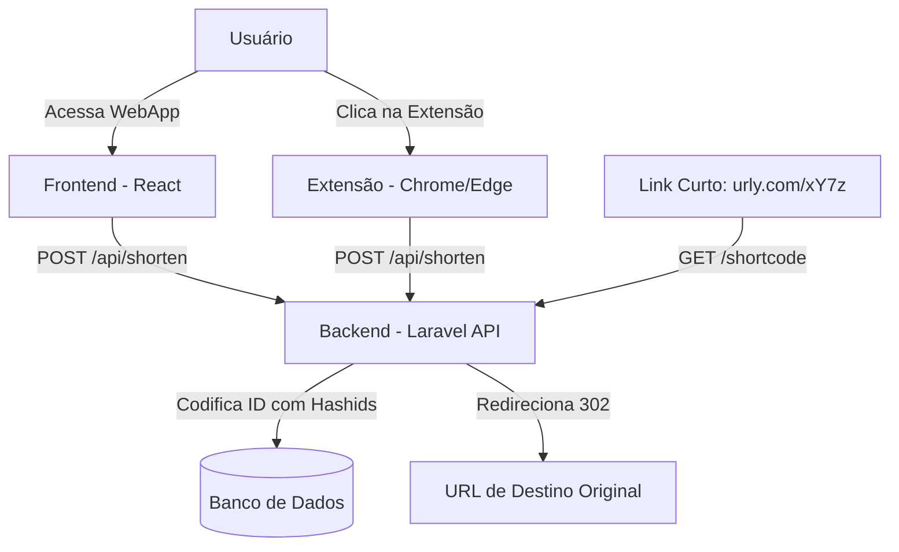

# Urly 🔗 — Encurtador de URLs Elegante & Leve

Este é o repositório principal do **Urly**, um ecossistema completo para encurtamento de URLs de forma rápida, segura e elegante. O projeto é dividido em três componentes principais: um **Backend em Laravel**, um **Frontend em React** e uma **Extensão de Navegador (Chrome/Edge)**.

---

## 🏗️ Arquitetura do Projeto

O ecossistema do **Urly** é composto por:

1. **`backend/`**: API REST desenvolvida em **Laravel 13** com **PHP 8.3**. Utiliza a biblioteca **Hashids** para gerar códigos únicos e não sequenciais para cada URL encurtada, salvando-os em um banco de dados relacional.
2. **`frontend/`**: Interface web moderna de página única (SPA) desenvolvida em **React 19**, que se conecta à API do backend para encurtar links e gerenciar o histórico local de URLs encurtadas.
3. **`extensão/`**: Uma extensão de navegador baseada em **Manifest V3** que permite ao usuário encurtar instantaneamente a aba ativa no navegador com apenas um clique, copiando automaticamente o resultado para a área de transferência.



---

## 📁 Estrutura de Pastas

```text
Urly - encurtador de url/
├── backend/            # API e lógica do servidor (Laravel 13)
├── frontend/           # Interface do usuário (React 19)
└── extensão/           # Extensão para Google Chrome (Manifest V3)
```

---

## 🚀 Como Executar o Projeto Localmente

### Pré-requisitos
*   **PHP** `>= 8.3`
*   **Composer**
*   **Node.js & npm**
*   **Banco de Dados** (PostgreSQL, MySQL ou SQLite)
*   **Servidor Local** (Laragon, Laravel Herd, XAMPP ou PHP CLI)

---

### 1. Configurando o Backend (Laravel)

1. Entre no diretório do backend:
   ```bash
   cd backend
   ```
2. Instale as dependências do Composer:
   ```bash
   composer install
   ```
3. Crie e configure o arquivo `.env`:
   ```bash
   cp .env.example .env
   ```
   Abra o arquivo `.env` e configure:
   * A conexão com o banco de dados (ex: `DB_CONNECTION`, `DB_HOST`, `DB_PORT`, `DB_DATABASE`, etc.).
   * Um salt seguro para encurtamento:
     ```ini
     HASHIDS_SALT=seu_salt_secreto_aqui
     ```
4. Gere a chave da aplicação e rode as migrations:
   ```bash
   php artisan key:generate
   php artisan migrate
   ```
5. Inicie o servidor do backend:
   ```bash
   php artisan serve
   # O backend estará disponível por padrão em http://localhost:8000
   ```

---

### 2. Configurando o Frontend (React)

1. Entre no diretório do frontend:
   ```bash
   cd ../frontend
   ```
2. Instale as dependências do Node:
   ```bash
   npm install
   ```
3. Inicie o servidor de desenvolvimento:
   ```bash
   npm start
   # O frontend abrirá automaticamente em http://localhost:3000
   ```

---

### 3. Instalando a Extensão (Chrome Extension)

1. Abra o Google Chrome (ou qualquer navegador baseado no Chromium).
2. Vá para `chrome://extensions/`.
3. Ative o **Modo do desenvolvedor** (canto superior direito).
4. Clique em **Carregar sem compactação** (canto superior esquerdo).
5. Selecione a pasta **`extensão/`** deste projeto.
6. Pronto! A extensão estará pronta para uso. Ao clicar nela, a URL da aba ativa será automaticamente encurtada pela sua API local e o link copiado para o seu clipboard.

---

## 📡 Referência da API do Backend

### 1. Criar URL Encurtada
Gera um código e retorna a URL encurtada.

*   **Endpoint:** `POST /api/shorten`
*   **Content-Type:** `application/json`
*   **Requisição:**
    ```json
    {
      "url": "https://github.com/google/deepmind"
    }
    ```
*   **Resposta (200 OK):**
    ```json
    {
      "url": "https://github.com/google/deepmind",
      "shortcode": "yL8aX",
      "shortUrl": "http://localhost:8000/yL8aX",
      "created_at": "2026-06-25 03:15:00"
    }
    ```

### 2. Redirecionar URL
Redireciona o usuário para o link original correspondente ao código curto.

*   **Endpoint:** `GET /{shortcode}`
*   **Exemplo:** Acessar `http://localhost:8000/yL8aX` retorna um status `302 Found` e redireciona o navegador para o link original.

---

## 🛡️ Licença

Este projeto é software de código aberto licenciado sob a [MIT License](https://opensource.org/licenses/MIT).
